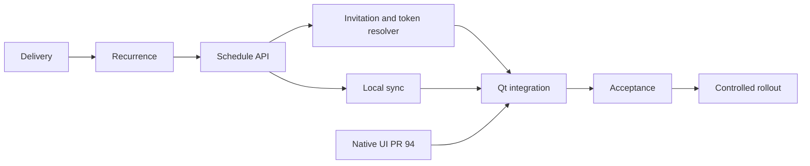

# Delivery Plan: постоянные приглашения повторяющихся встреч

Статус: In progress. Дата: 2026-10-01. Координатор поставки: Codex;
владелец продукта и решение о production rollout: Artem.
Основа: [Service Spec](recurring-call-service-spec.md), issue #98, PR #99.
Порядок работы: delivery-документ → Subagent-Driven Development → staging → rollout.
Документ составлен до реализации. Выполненные проверки фиксируются отдельно.

## Объём и результат

Поставляем одну постоянную ссылку на LiveKit-серию, серверную копию правил
повторения/переносов/отмен, отдельную комнату для каждой даты и устойчивую
синхронизацию из локальной базы. Специалист редактирует в Sessio; клиент
пользуется одной ссылкой, в том числе когда Sessio закрыт до начала встречи.

Целевой релиз — первый согласованный выпуск после интеграции native-call UI
из PR #94. Номер версии определяется относительно этой ветки; календарную дату
production не обещаем до staging-проверки. Документация остаётся в PR #99;
реализация идёт в отдельной зависимой ветке без изменений чужих рабочих деревьев.

В первую поставку входят создание серии, изменение одного повторения и всей
серии, прекращение повторений, перевыпуск/отзыв приглашения и восстановление
после offline. Не входят серверный редактор, multi-writer merge, публичная
страница календаря, принудительное завершение звонка, транскрипция и миграция
хранилища из #88. «Это и последующие» блокируется для опубликованной серии
до контракта сохранения приглашения через разделение. #91 (превращение уже
созданного одиночного события в серию) остаётся отдельной задачей.

## Потоки, владельцы и зависимости

| Этап | Владелец исполнения | Зависимость | Проверяемый результат |
| --- | --- | --- | --- |
| D0 Delivery и план исполнения | Координатор | Spec #98 | Этот документ и задачи с конкретными интерфейсами |
| D1 Расчёт повторений | Агент задачи 1 | D0 | Общий модуль без Widgets/DB, одинаковый расчёт UTC и DST |
| D2 Серверный snapshot | Агент задачи 2 | D1 | Миграция, isolation account, CAS revision, atomic replace |
| D3 Приглашение и комнаты | Агент задачи 3 | D2 | Одна ссылка выбирает нужное повторение, общий токен-путь |
| D4 Локальная синхронизация | Агент задачи 4 | D2 | UUID/timezone, транзакционный outbox, ACK/retry/conflict |
| D5 Qt интеграция | Агент задачи 5 | D3, D4, PR #94 | Создание, перенос, отмена, join/copy и видимые состояния |
| D6 Интеграция и приёмка | Агент задачи 6 + координатор | D1–D5 | Регрессии, переводы, миграция, воспроизводимый staging smoke |

Исполнители назначаются при dispatch. После каждого этапа отдельный reviewer
проверяет spec compliance и code quality; после всех этапов выполняется обзор
всей ветки. Агент не запускает своих агентов. Ledger хранит SHA, доказательства
проверок, findings и решения; ранее завершённые задачи не повторяются.

## Критический путь и readiness

На начало работы PR #94 открыт, актуальный head e3cb0e5. Реализация должна
использовать эту интеграцию, а не второй параллельный интерфейс звонков.
Зависимость от libical/timezone должна быть доступна в backend build/container;
её сборка проверяется в D1. Существующее подключение LiveKit используется без
изменения VPN/TLS/production credentials. Наличие доступного staging с двумя
участниками устанавливается перед D6; оно не считается доказанным по памяти.

- [x] Пользователь согласовал модель серверной копии расписания и одну ссылку.
- [x] Контракт подготовлен как Draft, ограничения первого этапа перечислены.
- [ ] Расчёт календаря и часового пояса одинаков на клиенте и сервере.
- [ ] Сервер/клиент готовы к совместимому обновлению; миграции проверены.
- [ ] Каждая задача имеет чистый независимый review.
- [ ] Offline/retry/concurrency/restore и legacy регрессии проходят.
- [ ] Русские/английские переводы синхронизированы; unfinished отсутствуют.
- [ ] Двусторонние аудио/видео проверены в двух повторениях по одной ссылке.
- [ ] Перед production определены retention и эксплуатационный ответственный.

## Rollout и переход

1. Завершить документацию и подготовить зависимую ветку реализации от PR #94.
2. Выполнять D1–D6 test-first, с review каждого этапа, без промежуточного
   включения новой функции на production. Публиковать изменения в draft PR.
3. Обновить staging backend с аддитивными таблицами/API и проверить старый
   клиент одиночных встреч. Новый клиент требует schedule capability сервера;
   при отсутствии поддержки серия не превращается в одиночную комнату.
4. Подключить новый клиент. Сначала создать тестовую серию и выполнить матрицу
   приёмки. HTTP success/build/test pass не заменяют реальный звонок.
5. В pilot включить новые серии и явную миграцию выбранной старой серии.
   Сначала подтвердить timezone и даты, дождаться ACK, получить новое
   приглашение, затем отключить старое. Клиенту один раз отправляется новая ссылка.
6. После решения владельца rollout обновить production обеих сторон. Оставить
   поддержку старых одиночных приглашений; отслеживать ошибки sync/resolver.

Rollback приложения не удаляет серверное расписание или приглашения. Старый
клиент не должен редактировать migrated LiveKit series через legacy meeting API;
если формат локальной БД не совместим, откат выполняется через подготовленный
backup с явным предупреждением о серверной версии. Откат backend ниже schedule
версии делает series ссылки недоступными: это деградация, а не переключение на
первую комнату. В pilot можно отключить новую функцию, сохранив серверные данные.

## Риски и критерии выхода

| Риск | Как ограничиваем | Gate |
| --- | --- | --- |
| Часовой пояс старой серии неизвестен | Подтверждение timezone и preview перед публикацией | D1/D5 |
| Offline отмена оставляет старый серверный доступ | Durable outbox и явное состояние отсутствующего ACK | D4/D5 |
| Потеря ответа/параллельный join создают дубли | CAS snapshot, idempotency key, уникальный occurrence key | D2/D3 |
| Старый backup или второе устройство перезаписывают календарь | Conflict вместо автоматического overwrite | D4 |
| Старый token endpoint обходит отмену | Общий актуальный resolver для series-backed meeting | D3 |
| RRULE старой бесконечной серии блокирует сервер | Seek и ограниченный бюджет, fail closed | D1/D3 |
| Split серии выдаёт новую ссылку молча | Явная блокировка неподдерживаемой операции | D5 |
| Постоянное приглашение утекло | Отзыв/generation, passcode, rate limits; секреты вне логов | D3/D5 |

Выход D6: тесты с реальной БД и HTTP подтверждают spec, Qt проверки выполняются
на изолированных config/data, чистый review и documented staging smoke. Если
staging/credentials недоступны, код и локальные проверки можно завершить, но
статус поставки остаётся «staging verification blocked», а не «готово к rollout».

## Решения до production

Retention серверной истории и операционный владелец выбираются до rollout.
Контракт split серии — отдельное расширение, не blocker первой ограниченной
версии. Политика статусов в D4: canceled=3, no-show=5, rescheduled=6 запрещают
вход, остальные текущие статусы разрешают его; перенос должен иметь действующий
override. Проверить значения по константам в выбранной базе реализации.

## Доказательства исполнения

На момент создания документа runtime-этапы не выполнены. Ledger конкретного
SDD-плана и отчёты агентов — источник SHA и результатов; финальный PR должен
отдельно перечислить локальные тесты, UI smoke и staging, включая блокеры.
