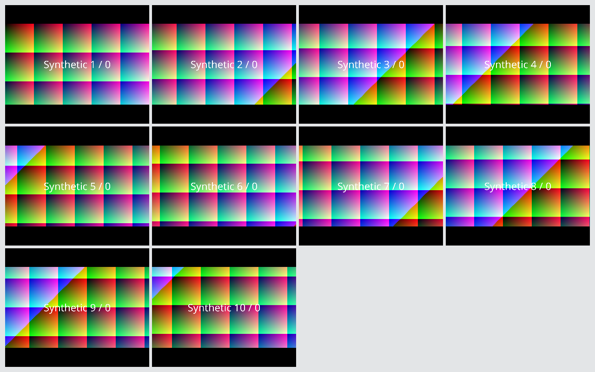

# Sessio #95 — video rendering benchmark (throwaway)

This is the research stage requested by [issue #95](https://github.com/Artem535/Sessio/issues/95),
before selecting tile rendering for 1:1 → 1:2 → 5–10 participants.
The prototype branch starts from `main`; it does not change the application.
The current-renderer comparison follows PR #94 head
`1212cd31c35bbe94fddaee9da8463466b8ea4fca`.

## Question and recommendation

Can one `QOpenGLWidget` per video tile handle 8–10 independent decoded RGBA
streams on the development laptop, and is CPU pre-scaling necessary?

**Recommendation:** keep `QOpenGLWidget` tiles for the first 1:2 layout and
scale the original image through QPainter's OpenGL paint engine. The synthetic
measurements support this approach without requiring a custom GL shader renderer.
Do not describe these measurements as proof that 10-person LiveKit calls work.

Each future participant needs a stable identity, independent media state and a
bounded video queue (`VideoStream::Options::capacity`, provisionally 2). The
participant model and frame delivery should remain independent of tile widgets;
the UI owns the tiles and selects layouts by participant count. Revalidate
actual remote subscriptions, decoding and audio mixing with three participants
before claiming functional group-call support.

## Measured environment

- Linux kernel `7.2.7-200.fc44.x86_64`; Wayland.
- AMD Ryzen 7 7840HS, 8 physical cores / 16 logical CPUs.
- AMD Radeon 780M, hardware OpenGL (`radeonsi`, Mesa 26.2.3).
- Qt 6.11.2; GCC 16.2.1; C++20; Release build.
- Fixed logical window 1280 × 800; device pixel ratio 1.
- 30 input frames/s per tile; 2-second warmup, 10-second measurement, two repeats.
- Modes interleaved; their order reversed in the second repeat.

CPU percentages use **100% = one fully occupied logical CPU**. GPU percentages
come from AMD `gpu_busy_percent`, sampled every 100 ms, and include the desktop
and other applications. They are not a per-process GPU measurement. Idle GPU
samples taken after the runs are retained in `idle-gpu.json`.

## Results

CPU and GUI-delay figures below are means of the two run measurements. FPS is
the minimum observed per-tile rate across the repeats. RSS is the larger sampled
peak; it includes the three-frame synthetic source pool per stream.

| Streams | Input | Mode | CPU, % of one core | Min tile fps | GPU p50, % (runs) | GUI timer delay p95, ms | RSS, MiB |
| --- | --- | --- | ---: | ---: | --- | ---: | ---: |
| 1 | 720p | CPU pre-scale | 19.4 | 30.00 | 7 / 7 | 0.89 | 154.9 |
| 1 | 720p | Painter scale | 5.0 | 30.00 | 7 / 7 | 0.67 | 147.8 |
| 3 | 720p | CPU pre-scale | 28.5 | 30.00 | 10 / 8 | 0.87 | 205.1 |
| 3 | 720p | Painter scale | 12.8 | 30.00 | 7 / 8 | 0.77 | 200.4 |
| 8 | 720p | CPU pre-scale | 79.2 | 30.00 | 11 / 11 | 2.84 | 327.3 |
| 8 | 720p | Painter scale | 51.8 | 30.00 | 12 / 12 | 1.24 | 322.8 |
| 10 | 720p | CPU pre-scale | 95.7 | 29.99 | 12 / 10 | 3.25 | 377.3 |
| 10 | 720p | Painter scale | 71.9 | 29.90 | 13 / 13 | 1.52 | 376.6 |
| 10 | 1080p | CPU pre-scale | 208.7 | 29.99 | 10 / 10 | 5.27 | 644.8 |
| 10 | 1080p | Painter scale | 153.6 | 29.99 | 18 / 17 | 3.34 | 636.3 |

At 10 × 720p, painter scaling reduces process CPU by about 25%; at 10 × 1080p,
by about 26%. Higher GPU load for painter scaling is expected because original
images, rather than pre-scaled smaller images, are uploaded. No measurement here
establishes minimum client hardware requirements.

Raw per-run/per-tile evidence: `results.json`. All 20 runs report a hardware AMD
renderer and nonzero unique painted frames for every tile. Screenshots from
both 10-stream 720p modes were visually inspected: all distinct tiles rendered.



## What the rendering measurement includes

- One producer thread per tile at 30 fps.
- A deep RGBA copy at the frame-ownership boundary, mirroring
  `RemoteVideoRenderer::readerLoop()` in PR #94.
- A latest-frame mutex, queued repaint notification, and one `QOpenGLWidget`
  per tile.
- Current `QImage::scaled(..., SmoothTransformation)` followed by `drawImage`,
  or direct `drawImage(target, original)` with `SmoothPixmapTransform`.
- Unique painted frame counts, CPU-side paint duration and delivered-frame age,
  GUI heartbeat delay, sampled RSS and system-wide GPU busy percentage.

Synthetic images are pre-generated before warmup. Source pools occupy 105.5 MiB
at 10 × 720p and 237.3 MiB at 10 × 1080p. The images change every frame, but they
are synthetic patterns rather than representative camera/codec workloads.

The rendering benchmark excludes network, WebRTC decoding, SDK FFI delivery,
pixel-format conversion before RGBA, audio, capture, model inference and the
full Sessio application. Frame ages end at `paintGL()` completion; they do not
measure display presentation or a GPU fence. Swap interval is requested as 0
to avoid driver throttling during the throughput probe; the compositor may
still impose presentation timing. All tiles are visible; hidden/minimized
windows or software OpenGL invalidate the intended comparison.

## Additional offline LiveKit SDK probe

Using the already downloaded Linux SDK 1.12.0, `sdk_stream_probe.cpp` creates
10 independent local `VideoSource` → `LocalVideoTrack` → `VideoStream::fromTrack`
paths, sets capacity to 2 and sends 90 distinguishable frames through each.
All 10 readers received 90 frames, with zero cross-track marker errors. Closing
the streams and joining the readers took 0.81 ms in this single run.

This confirms local per-track routing and closing blocked readers. It does
**not** verify participant identities, remote subscriptions or reconnects in
a LiveKit room. `sdk-stream-results.json` explicitly records this limitation.
The synthetic renderer and offline SDK probes ran separately.

## Reproduce on Linux

Requirements: CMake ≥ 3.28, C++20 compiler, Qt6 Widgets/OpenGLWidgets development
packages, Python 3, a visible hardware-accelerated desktop session.
No application build, model download, database, device access or credentials
are required. The standalone CMake project is deliberately excluded from the
application's CMake targets.

From the repository root:

```bash
cmake -S spikes/video-rendering-95 -B /tmp/sessio-video-rendering-95 -DCMAKE_BUILD_TYPE=Release
cmake --build /tmp/sessio-video-rendering-95 --parallel 4
python3 spikes/video-rendering-95/run_matrix.py \
  --binary /tmp/sessio-video-rendering-95/sessio-video-rendering-benchmark \
  --output /tmp/sessio-video-rendering-95/results.json
```

Pass `--gpu-metric` if AMD's device is not `card1`. The GPU metric is optional
for the standalone executable; an unavailable metric is reported as -1.
The runner refuses invalid rendering and known software renderers. Check that
the actual renderer reported in JSON matches the intended hardware.

On this Fedora host, `/usr/lib` also contains older Qt 6.10.2 libraries. For
these benchmark processes only, coherent system paths were selected explicitly:

```bash
LD_LIBRARY_PATH=/usr/lib64 QT_PLUGIN_PATH=/usr/lib64/qt6/plugins \
  python3 spikes/video-rendering-95/run_matrix.py \
    --binary /tmp/sessio-video-rendering-95/sessio-video-rendering-benchmark \
    --output /tmp/sessio-video-rendering-95/results.json
```

For the optional offline SDK probe, set `LiveKit_DIR` to an existing SDK's
`lib/cmake/LiveKit` and `LIVEKIT_CURL_LIBRARY` to its compatible libcurl,
as in the application's `src/video/CMakeLists.txt`. Build and run
`sessio-video-stream-probe`. No SDK download occurs in this project.

## Remaining implementation gate

As of this investigation, PR #94 is still open. Issue #95 explicitly requires
it to be merged after manual device verification before the participant model
and call UI implementation. The benchmark addresses the required initial
rendering investigation; #95 stays open. It does not establish that the current
single-remote audio/video provider already supports group calls.
